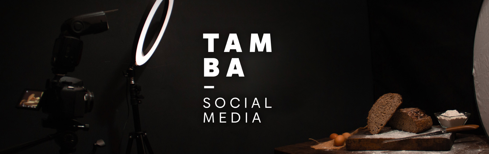
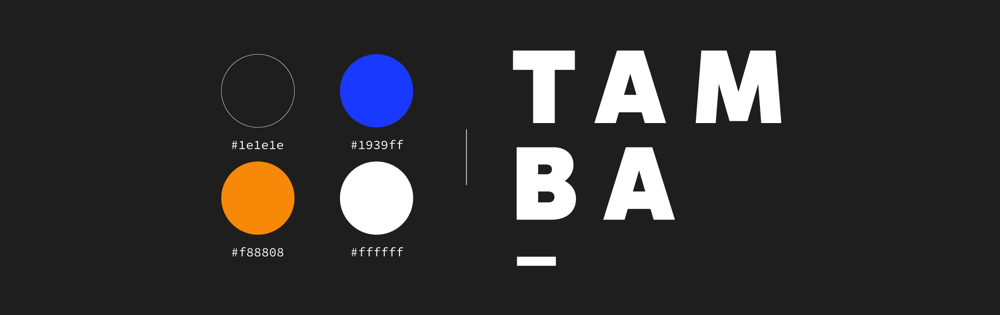

# Estudio TAMBA.
## Gestión de redes: fotografía y diseño

## Sobre nosotros
Somos TAMBA, un **equipo interdisciplinario** conformado por fotógrafos, diseñadores y productores trabajando en conjunto para ***potenciar tu imagen en redes***. Conformamos el equipo en abril del 2021 y desde entonces nos encontramos en **constante capacitación y crecimiento** para poder brindar un servicio a la vanguardia.

###### ¿Qué nos diferencia?
Somos **la solución a tus ventas en un solo lugar**. Queremos hacer que tu proyecto crezca, cambiando el modo en el que te ven. Nos mueven las ganas de crear imágenes que compartan experiencias.

###### ¿Qué servicios brindamos?
- :bulb: Creación de contenido para redes sociales
- :star: Community management
- :computer: Diseño gráfico
- :camera_flash: Fotografía de producto
- :movie_camera: Diseño y producción audiovisual
- :zap: Branding

## Público objetivo
- **Emprendedores** de cualquier género y rango etario de 30 a 65 años, que quieran potenciar su imagen y alcance en redes.
- **Pymes** de cualquier parte del país, que quieran potenciar su imagen y alcance en redes.

## Familias tipográficas
La tipografía principal será [Gantari](https://fonts.google.com/specimen/Gantari?category=Sans+Serif&preview.text=TAMBA&preview.text_type=custom#standard-styles) y la secundaria [Aleo](https://fonts.google.com/specimen/Aleo?query=aleo&preview.text=%26%26%26%26%26&preview.text_type=custom).

## Paleta cromática
Blanco #ffffff | Gris #1e1e1e | Azul #1939ff | Naranja #f88808

## Nuestras redes:
Podés encontranos en [Facebook](https://www.facebook.com/tamba.socialmedia/) :thumbsup: o visitar nuestro perfil de [Instagram](https://www.instagram.com/tamba.socialmedia/) :camera_flash:

## Bocetado de Wireframe:
Bocetado en la plataforma FIGMA, para visualizarlo hacé click [acá](https://www.figma.com/file/rTV2ZYD1yhy6Mtv2T38J9K/SPRINT-2?node-id=0%3A1)
